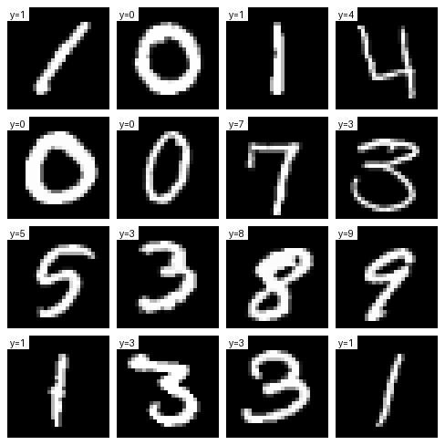

# 手写数字识别前向传播教学文档（Digit Recognizer）

本节目标是：**只做前向传播推理，不做训练**。你需要理解数据、网络结构、参数形状、前向计算、输出解释。

## 1. 任务目标（推理）

- 输入：28×28 的灰度图（展开为 784 维向量）
- 输出：0~9 的分类结果（10 类）
- 网络结构：`784 -> 50 -> 100 -> 10`
- 参数来源：已训练好的 `nn_sample`（包含 W1/W2/W3 与 b1/b2/b3）
- 仅进行推理，不包含训练或参数更新

## 2. 数据理解

`train.csv` 每一行是一张图：
- 第 1 列：真实标签 `label`（0~9）
- 后 784 列：像素值（0~255）

图像示例（前 16 张）：



## 3. 数据预处理

前向传播前，需要做两件事：

1) **归一化**：把像素缩放到 0~1
- `x = pixel / 255.0`

2) **形状**：
- 单张输入：`x` 形状 `(784,)`
- 批量输入：`X` 形状 `(batch, 784)`

## 4. 网络结构与参数形状

网络：`784 -> 50 -> 100 -> 10`

| 参数 | 形状 | 含义 |
|---|---|---|
| `W1` | (784, 50) | 输入层到隐藏层1 |
| `b1` | (50,) | 隐藏层1偏置 |
| `W2` | (50, 100) | 隐藏层1到隐藏层2 |
| `b2` | (100,) | 隐藏层2偏置 |
| `W3` | (100, 10) | 隐藏层2到输出层 |
| `b3` | (10,) | 输出层偏置 |

> **检查点**：参数形状必须与网络结构一致，否则说明 `nn_sample` 不是这套网络的参数。

## 4.1 如何从参数形状反推网络结构

只有在 **已经拿到参数** 的前提下，才可以从形状反推结构。方法很简单：  
**每一层神经元数量 = 该层权重矩阵的“列数”**。

以本例为例：

- `W1` 形状 `(784, 50)`：输入 784 维 → 第 1 隐藏层有 50 个神经元  
- `W2` 形状 `(50, 100)`：第 2 隐藏层有 100 个神经元  
- `W3` 形状 `(100, 10)`：输出层有 10 个神经元  

所以结构就是 `784 -> 50 -> 100 -> 10`。  
如果你拿到的 `nn_sample` 形状对不上，就说明它不是这套结构的参数。

## 5. 前向传播公式

设输入为 `x`，则：

```
a1 = x · W1 + b1
z1 = sigmoid(a1)

a2 = z1 · W2 + b2
z2 = sigmoid(a2)

a3 = z2 · W3 + b3
y  = softmax(a3)
```

- 隐藏层使用 `sigmoid`
- 输出层使用 `softmax` 得到 10 类概率

**softmax 公式**：

```
softmax(a_i) = exp(a_i) / sum_j exp(a_j)
```

## 6. 推理与预测

- `y` 是 10 维概率向量
- 预测类别 = `argmax(y)`

如果用 `train.csv`，你可以对比真实标签，计算准确率。

## 6.1 前因后果：为什么“位置 = 数字”

这条规则不是模型里写死的，而是**训练时由标签决定的**，即使你现在只做推理，也必须遵守它：

1) 数据标签本身是 0~9  
2) 训练时把标签转成 one-hot（如 3 -> `[0,0,0,1,0,0,0,0,0,0]`）  
3) 损失函数会推动第 3 个位置的输出变大  
4) 训练完成后得到 `nn_sample` 参数  
5) 推理时用 `argmax` 取最大位置作为预测数字

所以，“位置 = 数字”的对应关系来自**训练时的标签约定**，而不是推理阶段临时规定的。

## 7. 理解“为什么形状决定神经元数量”

以 `W1 (784, 50)` 为例：

- 输入是 `(784,)`
- `x · W1` 输出是 `(50,)`
- 输出的 50 个元素，就是 50 个神经元的输出

所以“权重矩阵的列数 = 该层神经元数量”。

## 8. 常见问题

- **输出全是同一个数字**：可能归一化漏了、参数错了、softmax 实现有误。
- **维度不匹配**：检查 `W1/W2/W3` 和输入的形状是否对齐。
- **数值溢出**：softmax 需做 `a3 - max(a3)` 的稳定化处理。

## 8.1 疑问点（常见困惑）

- **我没训练，为什么还要遵守“位置=数字”？**  
  因为 `nn_sample` 是别人训练好的参数，它的输出含义已固定，你只是在使用它。
- **“位置对应关系”在哪里写？**  
  不在推理代码里，而是训练时用标签做 one-hot 时隐含地确定的。
- **一定要 softmax 吗？**  
  若只取 `argmax`，不一定必须；但要解释成“概率”，就需要 softmax。

## 9. 学习顺序建议

1) 先理解形状与矩阵乘法
2) 再理解 sigmoid/softmax 的作用
3) 最后熟悉“输入 -> 输出”的完整推理链路

## 10. 你可以先做的练习

1) 只取 1 张图，手工跑完整前向传播
2) 打印每一层的输出形状，确认和理论一致
3) 预测 10 张图，看结果是否合理

---

当你确认 `nn_sample` 的文件格式和参数名字后，就能把这套流程跑起来。
如果你需要，我可以帮你把这份文档补成“带完整代码版”。
