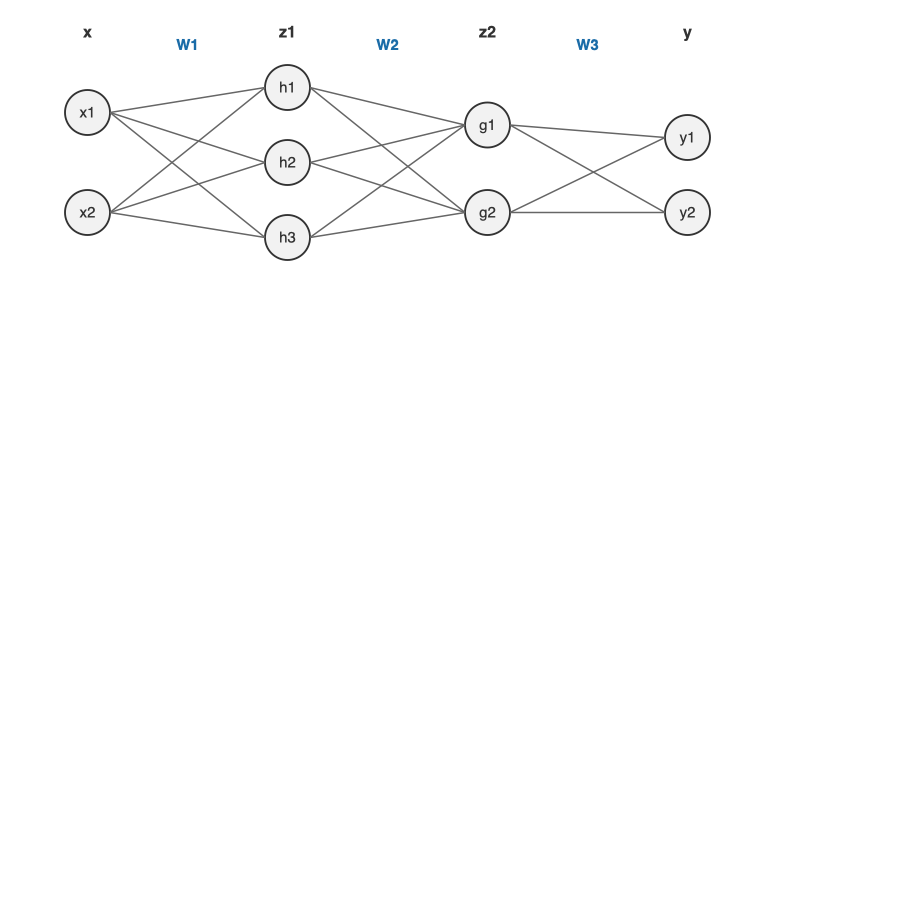
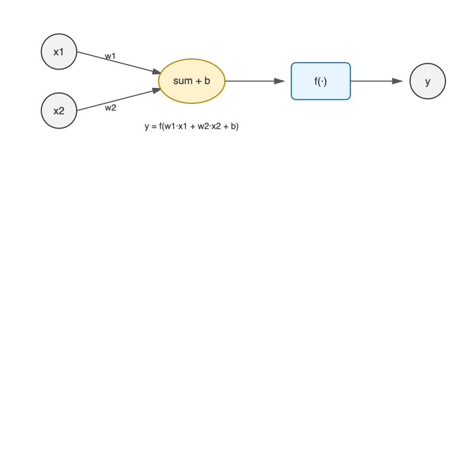
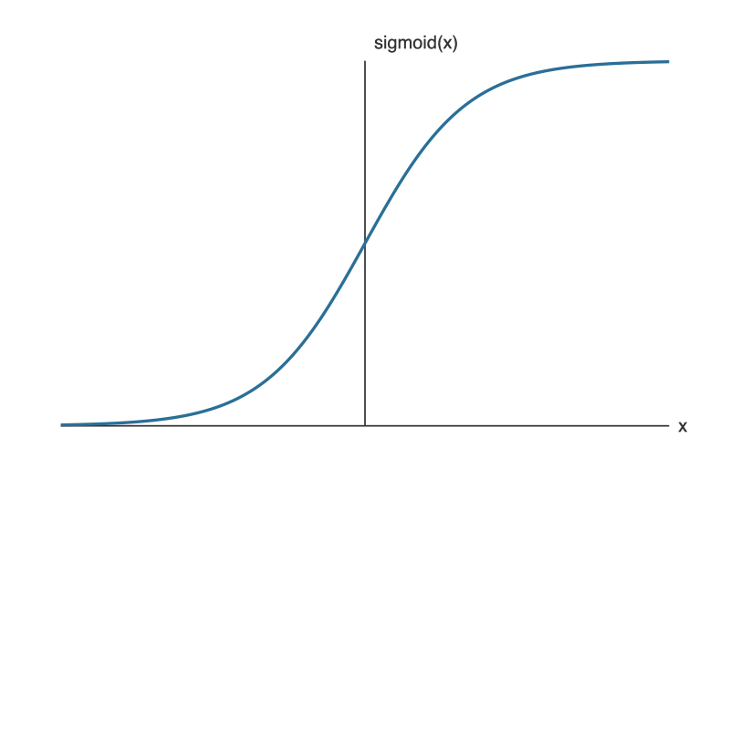

# 神经网络入门教学文档（基于 demo）

本节用 `deepleaner/common/network.py` 的固定参数前向传播示例，讲清神经网络最小可运行概念：线性变换、激活函数、层与输出。

## 1. 基本概念

- **神经元**：一个线性变换再接一个非线性激活。
- **层（Layer）**：多个神经元并行组成一层。
- **前向传播**：输入从第一层流向输出层的计算过程。
- **参数（Weights/Biases）**：可学习的数值矩阵和偏置向量。demo 中为了演示，使用固定值。

## 2. 本例网络结构

- 输入维度：2
- 隐藏层 1：3 个神经元（2 -> 3）
- 隐藏层 2：2 个神经元（3 -> 2）
- 输出层：2 个神经元（2 -> 2）
- 激活：隐藏层使用 `sigmoid`，输出层使用恒等函数（identity）

用箭头表示：

```
2  ->  3  ->  2  ->  2
x     z1     z2     y
```

案例网络结构示意图：



单个神经元示意图：



## 3. 前向传播公式

设输入为 `x`，则：

```
a1 = x · W1 + b1
z1 = sigmoid(a1)

a2 = z1 · W2 + b2
z2 = sigmoid(a2)

a3 = z2 · W3 + b3
y  = identity(a3)
```

其中：
- `W1, W2, W3` 是权重矩阵
- `b1, b2, b3` 是偏置向量
- `sigmoid` 是非线性激活，保证输出在 (0, 1)
- `identity` 是恒等函数，输出层不做额外变换

## 4. 激活函数（表达式与图像）

本例用到的两个激活函数如下：

**Sigmoid**

数学表达式：

```
sigmoid(x) = 1 / (1 + e^(-x))
```

图像：



**Identity（恒等函数）**

数学表达式：

```
identity(x) = x
```

图像：


## 5. 形状（shape）对照表

| 符号 | 形状 | 含义 |
|---|---|---|
| `x` | (2,) | 输入向量 |
| `W1` | (2, 3) | 输入到隐藏层 1 |
| `b1` | (3,) | 隐藏层 1 偏置 |
| `z1` | (3,) | 隐藏层 1 输出 |
| `W2` | (3, 2) | 隐藏层 1 到隐藏层 2 |
| `b2` | (2,) | 隐藏层 2 偏置 |
| `z2` | (2,) | 隐藏层 2 输出 |
| `W3` | (2, 2) | 隐藏层 2 到输出层 |
| `b3` | (2,) | 输出层偏置 |
| `y` | (2,) | 最终输出 |

## 6. 代码讲解

- `init_network()`：构造固定权重与偏置，方便学习前向传播流程。
- `forward(network, x)`：按层计算输出，逐层执行线性变换和激活。
- `if __name__ == '__main__':`：给定输入 `[1.0, 0.5]`，演示推理结果。

## 7. 运行方式与输出

运行：

```
python deepleaner/common/network.py
```

输出示例（浮点数略有误差）：

```
[0.31682708 0.69627909]
```

## 8. 思考与练习

1. 尝试修改 `W1` 或 `b1`，观察输出的变化。
2. 把输出层激活函数改成 `sigmoid`，会发生什么？
3. 把输入改成批量输入（二维数组），并支持一次推理多个样本。
4. 增加损失函数（如均方误差）并尝试手写反向传播的梯度。

## 9. 下一步建议

- 学习反向传播与梯度下降，理解“参数如何更新”。
- 将固定参数改为随机初始化，添加训练过程。
- 尝试用 PyTorch 实现相同结构，比较手写版与框架的差异。
